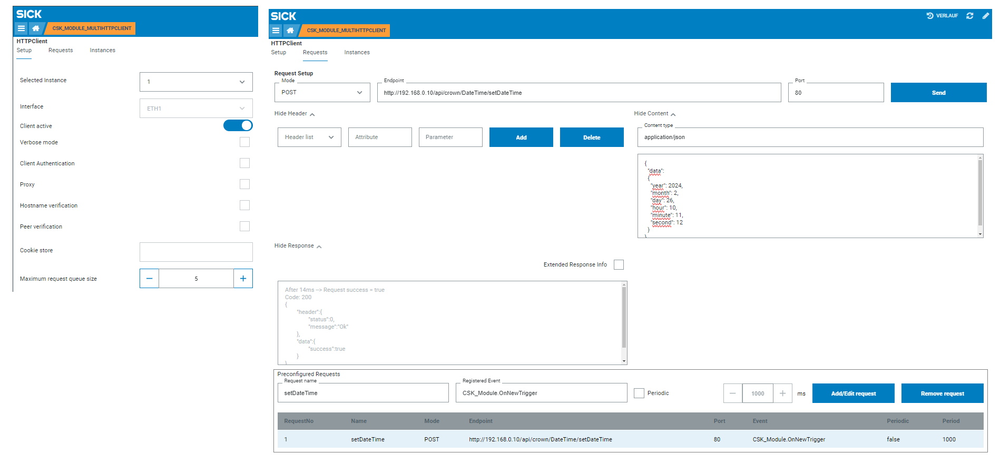

# CSK_Module_MultiHTTPClient

Module to provide HTTP/HTTPS client functionality on multiple instances to execute HTTP/HTTPS requests.  

## How to Run
The app includes an intuitive GUI to setup the communication.  
For further information check out the [documentation](https://raw.githack.com/SICKAppSpaceCodingStarterKit/CSK_Module_MultiHTTPClient/main/docu/CSK_Module_MultiHTTPClient.html) in the folder "docu".  

**IMPORTANT**  
If you want to make use of a domain name for an endpoint, please make sure that you use a valid DNS server on your system. E.g. you can make use of the [CSK_Module_DeviceNetworkConfig](https://github.com/SICKAppSpaceCodingStarterKit/CSK_Module_DeviceNetworkConfig) to configure one.  

## Information

Tested on  

|Device|Firmware|Module version
|--|--|--|
|SICK AppEngine|V1.7.0|V2.0.0|
|SIM1012|V2.4.2|V2.0.0|
|SIM1012|V2.3.0|V1.0.0|

This module is part of the SICK AppSpace Coding Starter Kit developing approach.  
It is programmed in an object-oriented way. Some of the modules use kind of "classes" in Lua to make it possible to reuse code / classes in other projects.  
In general, it is not neccessary to code this way, but the architecture of this app can serve as a sample to be used especially for bigger projects and to make it easier to share code.  
Please check the [documentation](https://github.com/SICKAppSpaceCodingStarterKit/.github/blob/main/docu/SICKAppSpaceCodingStarterKit_Documentation.md) of CSK for further information.  

## Topics

Coding Starter Kit, CSK, Module, SICK-AppSpace, HTTP, HTTPS, Client, REST, API, Request, HTTPClient
